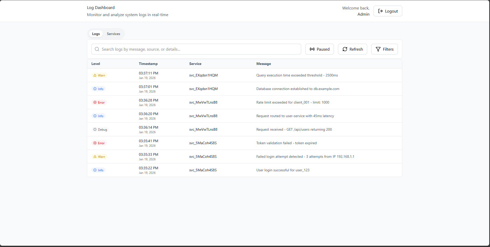
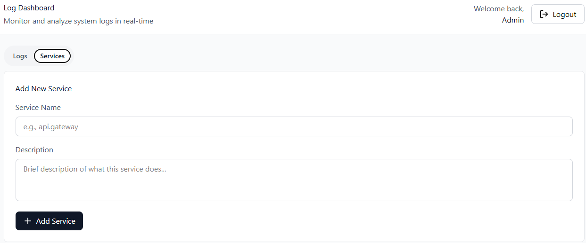
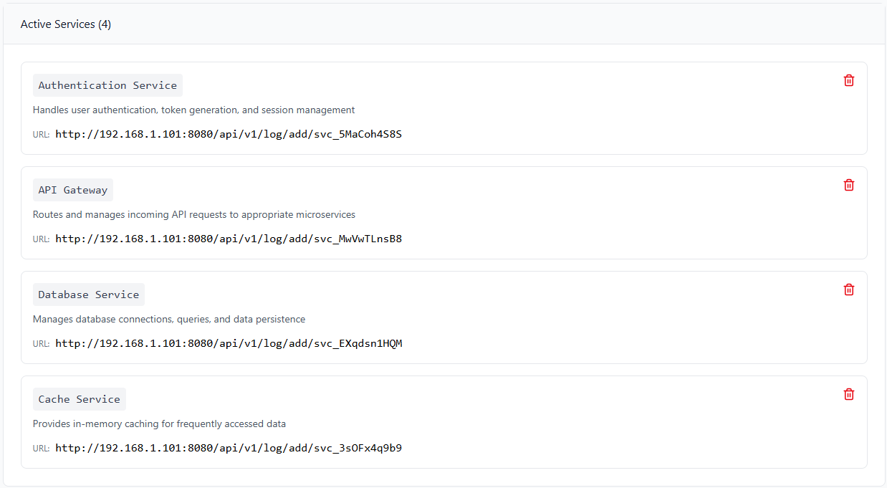
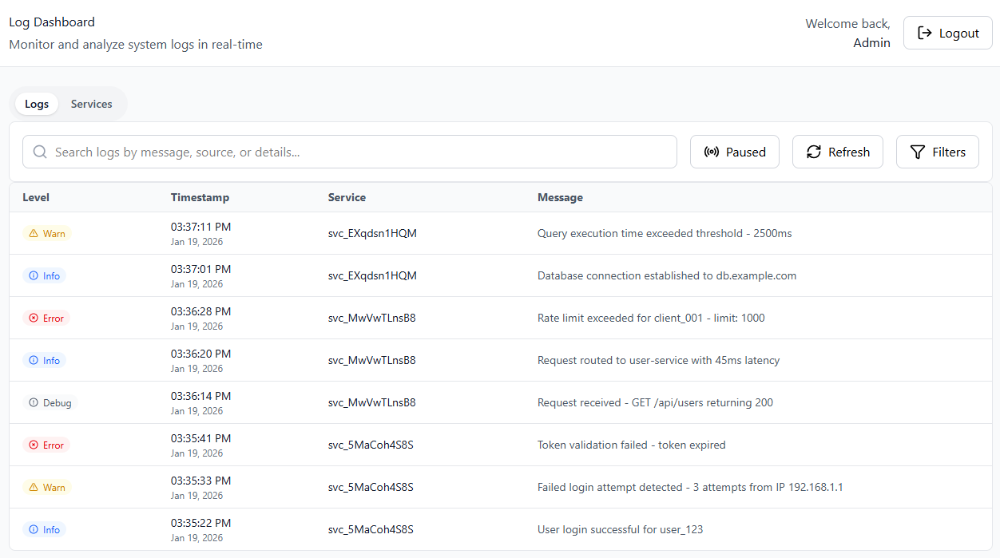

# LightLogger



LightLogger is a lightweight log collection and monitoring platform built for startups, small teams, and internal systems that want visibility into logs without complex or expensive tools.

It focuses on simplicity, clarity, and low overhead.

# Table of Contents

- [Usage Warning](#usage-warning)
- [Why LightLogger](#why-lightLogger)
- [Current Features](#current-features)
- [What LightLogger Does NOT Do (Yet)](#what-lightlogger-does-not-do-yet)
- [Tech Stack](#tech-stack)
- [Architecture Overview](#architecture-overview)
- [Example Use Cases](#example-use-cases)
- [Who Is It For](#who-is-it-for)
- [Getting Started](#getting-started)
- [Customization](#customization)

## Usage Warning

⚠️ **Important Notice:**

This setup is **not ready for public deployment**. It is intended **only for internal company logging and testing purposes**.

- Do **not** expose this service to the internet without proper security measures.
- Default credentials and settings are insecure for production.
- Use strong secrets and restrict access if deploying internally.

Always treat the dashboard and logs as sensitive internal data.

## Why LightLogger

Most logging platforms are heavy and costly.
LightLogger keeps things simple and easy to run.

- Easy log ingestion
- Centralized log storage
- Fast search and filtering
- Clean web dashboard

## Current Features

### Log Ingestion

- Accept logs over HTTP
- JSON structured logs
- Tag logs by service, level, and environment

### Log Storage

- PostgreSQL based storage
- Indexed for fast queries
- Reliable and easy to manage

### Log Viewing

- Real time style log viewing via polling

### Dashboard

- Web based UI
- Minimal and clean interface
- Designed for quick understanding

## What LightLogger Does NOT Do (Yet)

- No alerts or notifications
- No anomaly detection
- No automatic security response
- No distributed tracing
- Log filtering

## Tech Stack

### Backend

- Go
- Gin framework

### Database

- PostgreSQL

### Frontend

- React

### Deployment

- Docker
- Docker Compose

## Architecture Overview

1. Applications send logs to LightLogger API
2. Backend validates and stores logs
3. Logs are indexed and stored in PostgreSQL
4. Dashboard queries logs for display

## Example Use Cases

- Centralize logs from multiple services
- Debug production issues
- Monitor errors manually
- Observe system behavior over time

## Who Is It For

- Startups
- Small businesses
- Solo developers
- Internal tools
- Learning observability fundamentals

## Getting Started

### Prerequisites

- Docker
- Docker Compose

### Configuration

Before running the server, update the default environment values in the `compose.yml` file to suit your setup. This ensures security and proper database connection.

**Backend service environment variables:**

```yaml
environment:
  DB_HOST: db
  DB_PORT: 5432
  DB_USER: lightlogger # Change to your database username
  DB_PASSWORD: lightlogger # Change to your database password
  DB_NAME: lightlogger # Change to your database name
  JWT_SECRET: your-secret-key-change-in-production # Change to a strong secret
```

**PostgreSQL service environment variables:**

```yaml
environment:
  POSTGRES_USER: lightlogger # Change to match backend DB_USER
  POSTGRES_PASSWORD: lightlogger # Change to match backend DB_PASSWORD
  POSTGRES_DB: lightlogger # Change to match backend DB_NAME
```

> Make sure these values are consistent between the backend and database services. Never use default secrets in production.

### Running

Clone the repository and start the services using Docker Compose:

```bash
git clone https://github.com/heshanthenura/lightlogger
cd lightlogger
docker-compose up -d
```

- Dashboard will be accessible at `http://<<host_ip>>:8080`

  > If you want to use a different port, update the `ports` mapping for the backend service in the `docker-compose.yml` file. For example:

  ```yaml
  ports:
    - "9090:8080" # Maps container port 8080 to host port 9090
  ```

To stop the services:

```bash
docker-compose down
```

### Usage

1. Access the dashboard at `http://<<host_ip>>:8080` and log in using the default credentials:

   ```
   Username: admin
   Password: admin
   ```

2. Add a new service in the dashboard.



3. After adding, note the **service ID** and its corresponding **URL**.
   
4. Send an HTTP `POST` request to the service URL with a JSON body like this:

```json
{
  "level": "warn",
  "message": "Query execution time exceeded threshold - 2500ms"
}
```

- Supported log levels:

  ```
  debug, info, warn, error, fatal
  ```

5. The logs will appear in the dashboard under the corresponding service.
   

## Customization

This setup can be customized according to your company’s requirements. If you want additional features, integrations, or workflow changes, reach out to me.

customization can be done for an affordable cost to suit your internal logging needs.
